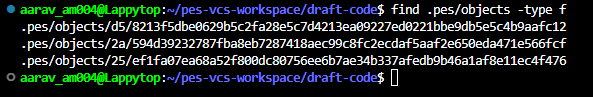
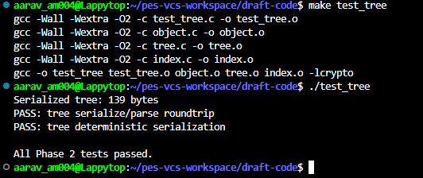
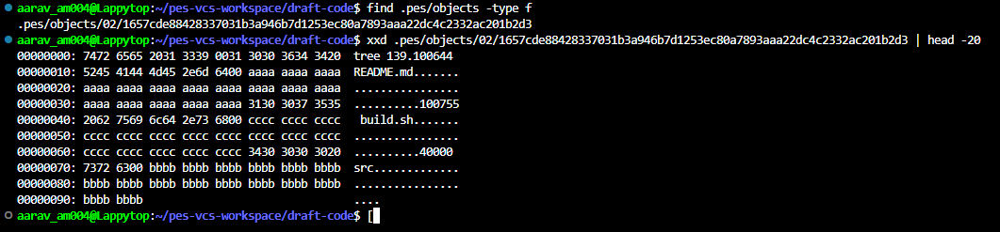
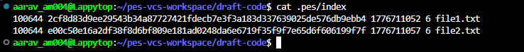
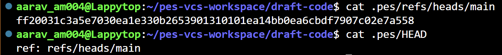
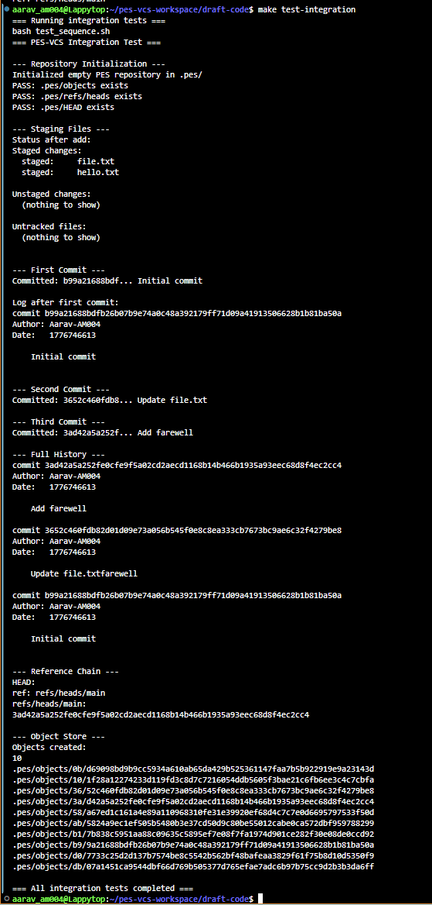

# PES-VCS — Version Control System from Scratch

> A local, Git-style version control system implemented in C for an OS lab. Tracks file changes, manages a staging area, stores snapshots using content-addressable storage (SHA-256), and builds a linked commit history.

---

## Table of Contents

- [Overview](#overview)
- [Features](#features)
- [Project Structure](#project-structure)
- [Implementation Phases](#implementation-phases)
  - [Phase 1: Object Storage Foundation](#phase-1-object-storage-foundation)
  - [Phase 2: Tree Objects](#phase-2-tree-objects)
  - [Phase 3: The Index (Staging Area)](#phase-3-the-index-staging-area)
  - [Phase 4: Commits and History](#phase-4-commits-and-history)
- [Design Analysis](#design-analysis)
  - [Branching and Checkout](#branching-and-checkout)
  - [Detecting a Dirty Working Directory](#detecting-a-dirty-working-directory)
  - [Detached HEAD State](#detached-head-state)
  - [Garbage Collection Algorithm](#garbage-collection-algorithm)
  - [GC Race Conditions](#gc-race-conditions)

---

## Overview

PES-VCS is a from-scratch implementation of a version control system modeled after Git's core internals. It demonstrates:

- **Content-addressable object storage** using SHA-256 hashing and sharded directories
- **Staged commits** via an `.pes/index` file tracking blob metadata
- **Recursive tree objects** that mirror directory structure
- **Linked commit history** with author metadata and `HEAD`/branch reference pointers
- **Atomic writes** to prevent data corruption on crashes

---

## Features

- `pes init` — Initialize a new repository
- `pes add <files>` — Stage files (hash, store as blob, update index)
- `pes status` — Show staged vs. unstaged changes
- `pes commit -m "<msg>"` — Create a commit from the current index
- `pes log` — Walk and display the commit history

---

## Project Structure

```
.pes/
├── HEAD                  # Points to current branch or commit hash
├── index                 # Staging area (sorted, atomic writes)
├── objects/              # Content-addressable store (sharded by first 2 hex chars)
│   └── ab/
│       └── cdef1234...  # Blob, tree, or commit object
└── refs/
    └── heads/
        └── main          # Branch pointer (stores commit hash)
```

---

## Implementation Phases

### Phase 1: Object Storage Foundation

Built the core storage engine with deduplication and atomic writes. Files are written to a `.tmp` path first, then renamed — ensuring the store is never left in a corrupt state if the process crashes mid-write.

Every object is SHA-256 hashed. The first two characters of the hex digest form a subdirectory; the remainder is the filename. This sharding keeps directory sizes manageable at scale.

```bash
make test_objects
./test_objects
find .pes/objects -type f
```

| Screenshot | Description |
|---|---|
|  | Tests passing |
|  | Sharded object directory structure |

---

### Phase 2: Tree Objects

Implemented recursive tree construction from a flat list of staged files. Files are grouped by directory prefix, and trees are built bottom-up — matching Git's actual directory tracking behavior. The resulting tree objects are stored in binary format.

```bash
make test_tree
./test_tree
xxd <tree-object-path> | head -20
```

| Screenshot | Description |
|---|---|
|  | Tests passing |
|  | Raw binary hex dump of a tree object |

---

### Phase 3: The Index (Staging Area)

Built the `.pes/index` tracking system. When a file is staged with `pes add`, it is hashed, saved as a blob object, and registered in the index with its metadata (size, modification time). The index is kept sorted for deterministic behavior and written atomically.

```bash
./pes init
echo "hello" > file1.txt
echo "world" > file2.txt
./pes add file1.txt file2.txt
./pes status
cat .pes/index
```

| Screenshot | Description |
|---|---|
|  | `add` and `status` output |
|  | Raw text content of the index file |

---

### Phase 4: Commits and History

Tied all components together. The commit process:

1. Builds a tree object from the current index
2. Links it to the parent commit hash
3. Attaches author metadata and a timestamp
4. Serializes the commit object to disk
5. Advances the `HEAD` and branch reference pointer

```bash
./pes commit -m "Initial commit"
echo "Goodbye" > bye.txt
./pes add bye.txt
./pes commit -m "Add farewell"
./pes log
find .pes -type f | sort
cat .pes/refs/heads/main
cat .pes/HEAD
make test-integration
```

| Screenshot | Description |
|---|---|
|  | Commit log output |
|  | Object store growth after two commits |
|  | Reference chain (`HEAD` → branch → commit hash) |
|  | Integration test passing |

---

## Design Analysis

### Branching and Checkout

To implement `pes checkout <branch>`, the system reads the target commit hash from the branch reference file and updates `.pes/HEAD`. The more complex part is safely updating the working directory: the system must recursively traverse the target commit's tree and mirror those files to disk, while refusing to overwrite any uncommitted work the user currently has.

### Detecting a Dirty Working Directory

Conflict detection uses a three-way check without rehashing everything:

1. **Compare trees** — diff the current branch's tree against the target branch's tree to identify which files actually differ between them.
2. **Check the index** — if a file's metadata in the index diverges from the current branch's baseline, the user has modified or staged it locally.
3. **Conflict decision** — if a file is locally modified *and* differs between the two branches, the checkout is refused to protect unsaved work.

### Detached HEAD State

When committing in a detached HEAD state, the commit object is saved correctly to the object store and `HEAD` is updated to point directly at the new hash. However, since no branch pointer (e.g., `main`) is updated, switching branches immediately orphans those commits — they become unreachable by standard log traversal. Recovery requires finding the exact orphaned commit hash and manually creating a new branch reference pointing to it.

### Garbage Collection Algorithm

A **mark-and-sweep** using a hash set is the correct approach for cleaning a large repository:

- **Mark phase** — Starting from every branch reference in `.pes/refs/heads/`, walk backwards through parent commits and add every reachable commit, tree, and blob hash to a hash set (O(1) membership checks).
- **Sweep phase** — Iterate through all files in `.pes/objects/` and delete any whose hash is absent from the set.

For a repository with 100k commits, the mark phase must traverse millions of blobs and subtrees, but the sweep itself is highly efficient given O(1) lookups.

### GC Race Conditions

Running GC concurrently with active commits introduces a dangerous race condition. For example: `pes add file.txt` creates a new blob object; if GC sweeps at that instant — before `pes commit` links it into a tree — the blob is deleted because it isn't yet reachable from any commit, corrupting the in-progress commit.

Git mitigates this with a **grace period** (typically two weeks): GC only deletes unreachable objects whose file timestamps prove they are genuinely old and abandoned, leaving recently created objects untouched regardless of reachability.
